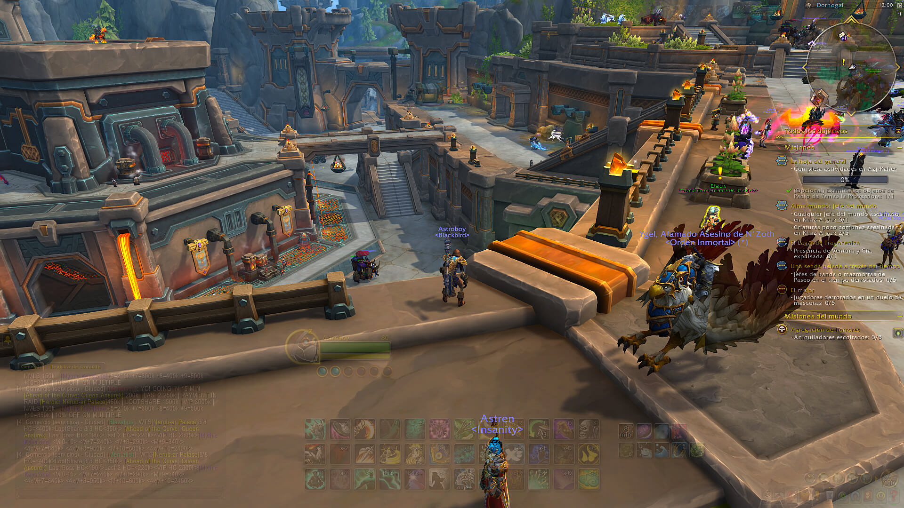

# HideUI Addon for World of Warcraft
HideUI is an addon designed to adjust the opacity of any frame in the game, including those created by other addons. This addon enhances frames with additional features like adaptive opacity adjustment based on certain events, such as being AFK, mounted, in combat, or inside an instance.

Since the introduction of the edit mode, which allows you to adjust the positioning of UI frames, I felt that something was missing—and that was the ability to adjust their opacity. HideUI can be considered an extension of the edit mode.

HideUI works seamlessly with the game's native interface, integrating smoothly to offer a more personalized and dynamic experience.

## Preview

## Recursos
- https://www.townlong-yak.com/framexml/beta/Blizzard_Settings_Shared/Blizzard_Settings.lua#171
- https://warcraft.wiki.gg/wiki/Patch_11.0.0/API_changes
- https://www.townlong-yak.com/framexml/latest/Blizzard_Menu/11_0_0_MenuImplementationGuide.lua
- https://www.townlong-yak.com/framexml/live/Blizzard_Settings_Shared/Blizzard_SettingControls.xml#174
- https://www.townlong-yak.com/framexml/live/Blizzard_Settings_Shared/Blizzard_SettingControls.lua#932