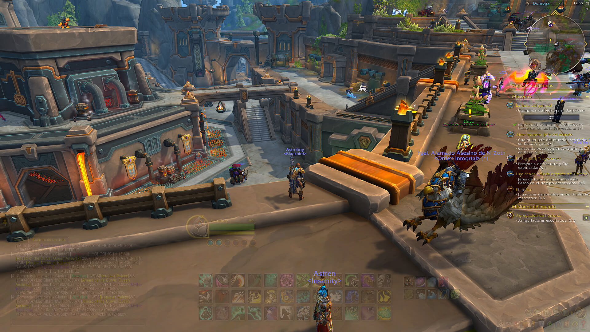

  

# gUI - GhostUI

**gUI** is an addon designed to adjust the opacity of any frame in the game, including those created by other addons. It enhances the interface with dynamic features like adaptive opacity based on specific events—such as being AFK, mounted, in combat, or inside an instance.

With the introduction of Blizzard's **Edit Mode**, players gained the power to move UI elements, but the ability to control their visibility remained limited. **gUI** serves as a natural extension of Edit Mode, allowing frames to fade away and blend into the environment when they aren't needed.

## Key Features
* **Full Opacity Control:** Adjust any registered frame from $0$ to $1$ with precision.
* **Dynamic Adaptability:** Individual and group profiles for specific events (Combat, Mount, AFK, etc.).
* **Proximity Reveal:** Mouseover functionality to smoothly show hidden frames.
* **Smooth Transitions:** All state changes utilize high-quality fade-in and fade-out effects.
* **Native Integration:** Works seamlessly with the stock Blizzard UI for a clean and personalized experience.

## Preview

## Technical Resources
This project is built using Blizzard's API documentation and community-driven resources:
* [Patch 11.0.0 API Changes](https://warcraft.wiki.gg/wiki/Patch_11.0.0/API_changes)
* [Blizzard Menu Implementation Guide](https://www.townlong-yak.com/framexml/latest/Blizzard_Menu/11_0_0_MenuImplementationGuide.lua)
* [Blizzard Setting Controls](https://www.townlong-yak.com/framexml/live/Blizzard_Settings_Shared/Blizzard_SettingControls.lua#932)